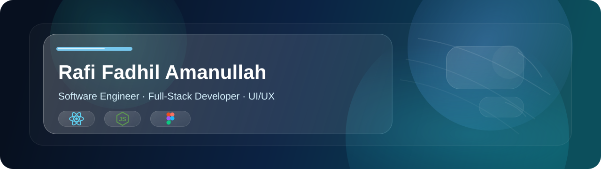

<!-- @format -->

  💻 Coding Enthusiast | ⚛️ Full-Stack Development | 🎨 UI/UX

  <a href="YOUR_PORTFOLIO_URL">Portfolio</a>
  ·
  <a href="https://www.linkedin.com/in/rafi-fadhil-amanullah-0b1412326/">LinkedIn</a>
  ·
  <a href="https://www.instagram.com/rffadhil_/">Instagram</a>
  ·
  <a href="mailto:raficoding8@gmail.com">Email</a>

## About Me

I'm an Informatics Engineering student at Universitas Pamulang with an interest in
software engineering, full-stack web development, and UI/UX.

I enjoy building web applications, exploring new technologies, and continuously
improving my skills through projects and hands-on learning.

## Tech Stack

  
  
  
  
  
  
  
  
  
  
  
  
  
  
  
  
  

## Currently Learning & Building

Currently focused on strengthening my full-stack development skills by building
web applications with modern JavaScript technologies and exploring software
engineering best practices.

## GitHub Statistics

  

  

## Contribution Graph

<picture>
  <source media="(prefers-color-scheme: dark)" srcset="https://raw.githubusercontent.com/rffadhil/rffadhil/output/github-snake-dark.svg" />
  <source media="(prefers-color-scheme: light)" srcset="https://raw.githubusercontent.com/rffadhil/rffadhil/output/github-snake.svg" />
  
</picture>
